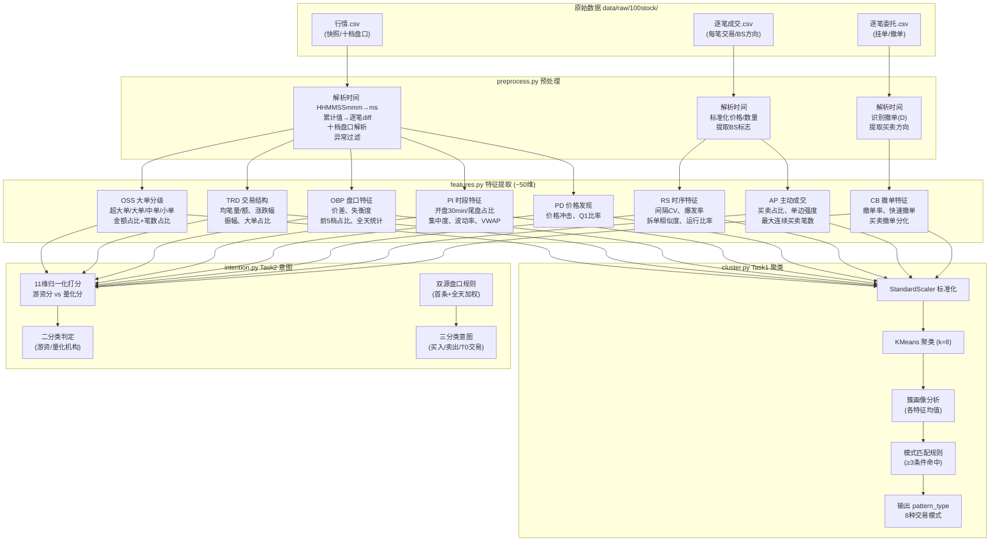

# Baseline 项目结构

## 目录结构

```
newdaba/
├── main.py                          # 主流程编排（4阶段）
├── AGENTS.md                        # 开发规范
├── 项目结构.md                       # 本文件
├── 【跑通Baseline】赛题一.md          # 赛题说明
│
├── modules/                         # 核心模块
│   ├── __init__.py                  # 包初始化
│   ├── preprocess.py                # ① 数据预处理
│   ├── features.py                  # ② 特征工程（8类特征 + 增量保存）
│   ├── cluster.py                   # ③ Task1: KMeans聚类 + 多条件联合匹配
│   └── intention.py                 # ④ Task2: 11维打分 + 双源盘口意图识别
│
├── data/
│   ├── raw/100stock/                 # 原始Level2数据
│   │   └── {股票代码}.SH/
│   │       ├── 行情.csv             #   十档盘口快照（~3秒/条）
│   │       ├── 逐笔成交.csv         #   逐笔成交记录
│   │       └── 逐笔委托.csv         #   逐笔委托记录（含撤单）
│   ├── features/                    # 特征输出（每只股票一个CSV，运行中增量写入）
│   │   └── {股票代码}.csv
│   └── 参考特征集.md                 # 官方参考特征定义
│
└── output/                          # 最终提交文件
    ├── pattern_reco.csv             # Task1 输出（stock_code, transaction_date, pattern_type, pattern_explanation）
    └── predict_result.csv           # Task2 输出（stock_code, transaction_date, capital_type, capital_intention）
```

## 数据流

```
data/raw/100stock/{code}/  行情.csv + 逐笔成交.csv + 逐笔委托.csv
        │
        ▼  preprocess.py
        │  · 时间解析（HHMMSSmmm → hour/minute/second/ms）
        │  · 累计值 diff 转逐笔（当日累计成交量/成交额/成交笔数）
        │  · 十档盘口解析（申买/申卖 1-10 档）
        │  · 异常值过滤
        │
        ▼  features.py
        │  · OSS 大单分级特征（超大/大/中/小单金额&笔数占比）
        │  · TRD 交易结构特征（均价/标准差/涨跌幅/大单比）
        │  · RS 订单时序特征（间隔CV/拆单相似度/爆发率）
        │  · CB 撤单特征（撤单率/快速撤单/买卖撤单分化）
        │  · AP 主动成交特征（主动买卖占比/连续笔数/单边强度）
        │  · OBP 盘口特征（价差/失衡度/挂单偏移/买卖比）
        │  · PI 日内时段特征（开盘30分/尾盘10分/集中度/波动率)
        │  · PD 价格发现特征（价格冲击/盘口不平衡比率）
        │  → 即时保存到 data/features/{code}.csv
        │
        ▼  features.load_all_features() → 合并为特征矩阵 DataFrame
        │
        ├──▶ cluster.py (Task1)
        │    · StandardScaler 标准化
        │    · KMeans(n=8) 聚类
        │    · 簇画像统计（各特征均值）
        │    · 多条件联合匹配（≥3命中）→ 8种交易模式
        │    → output/pattern_reco.csv
        │
        └──▶ intention.py (Task2)
             · 11维全局MinMax归一化
             · 游资/量化双向加权打分
             · 双源盘口联合（首条快照40% + 全天均值60%）
             · 主动成交占比联合规则 → 买入/卖出/T0交易
             → output/predict_result.csv
```

## 模块职责

### `preprocess.py` — 数据预处理

| 函数                                               | 功能                                     |
| -------------------------------------------------- | ---------------------------------------- |
| `load_stock_data(stock_code, raw_dir)`           | 读取3类原始CSV（gbk编码）                |
| `preprocess_quotes(df)`                          | 时间解析、累计值diff、盘口解析、异常过滤 |
| `preprocess_trades(df)`                          | 成交时间解析、BS标志、价格×数量=金额    |
| `preprocess_orders(df)`                          | 委托时间解析、委托类型/代码解析          |
| `load_and_preprocess_stock(stock_code, raw_dir)` | 一站式加载+预处理                        |

### `features.py` — 特征工程

| 函数                                         | 提取特征类           | 维度 |
| -------------------------------------------- | -------------------- | ---- |
| `extract_oss_features(quotes)`             | OSS大单分级          | 8    |
| `extract_trd_features(quotes)`             | TRD交易结构          | 6    |
| `extract_rs_features(trades)`              | RS订单时序           | 8    |
| `extract_cb_features(orders)`              | CB撤单系列           | 8    |
| `extract_ap_features(trades)`              | AP主动成交           | 7    |
| `extract_obp_features(quotes)`             | OBP盘口微观          | 12   |
| `extract_pi_features(quotes)`              | PI日内时段           | 6    |
| `extract_pd_features(quotes)`              | PD价格发现           | 2    |
| `extract_all_features(stock_code, data)`   | 汇总全部特征         | ~56  |
| `save_features(stock_code, features, dir)` | 即时保存单只股票特征 |      |
| `load_all_features(dir)`                   | 合并加载全部特征     |      |

### `cluster.py` — Task1 交易模式聚类

| 函数                                 | 功能                                    |
| ------------------------------------ | --------------------------------------- |
| `prepare_feature_matrix(df)`       | 数值特征选择 + StandardScaler标准化     |
| `run_clustering(df)`               | KMeans(n=8)聚类 + 轮廓系数/CH/DB评估    |
| `build_cluster_profiles(df, cols)` | 各簇特征均值画像                        |
| `assign_patterns(df, cols)`        | 多条件联合匹配（≥3命中）→ 8种模式语义 |
| `save_pattern_result(df, path)`    | 输出 pattern_reco.csv                   |

**8种交易模式：**

1. 游资强势连板拉升
2. 游资对倒出货
3. 游资吸筹建仓
4. 量化高频T0交易
5. 量化套利交易
6. 量化对冲配置
7. 机构减仓撤离
8. 机构长线配置（兜底）

### `intention.py` — Task2 资金与意图识别

| 函数                              | 功能                                            |
| --------------------------------- | ----------------------------------------------- |
| `identify_capital_type(df)`     | 11维MinMax归一化 + 加权打分 → 游资/量化机构    |
| `identify_intention(df)`        | 双源盘口失衡 + 主动成交占比 → 买入/卖出/T0交易 |
| `identify_all(df)`              | Task2完整流程                                   |
| `save_predict_result(df, path)` | 输出 predict_result.csv + 格式校验              |

**11个打分维度：**

| 维度        | 特征                          | 倾向   |
| ----------- | ----------------------------- | ------ |
| 0 OSS大额   | mega/large amount pct         | 游资↑ |
| 1 RS拆单    | split similarity, burst ratio | 量化↑ |
| 2 CB撤单    | fast cancel, buy cancel ratio | 量化↑ |
| 3 AP单边    | active buy pct, net pct       | 游资↑ |
| 4 OBP盘口   | spread pct, book imbalance    | 量化↑ |
| 5 PD冲击    | pd_impact, Q1_ratio           | 游资↑ |
| 6 PI时段    | time concentration, price std | 游资↑ |
| 7 连续买入  | buy run max                   | 游资↑ |
| 8 盘口大单  | big bid/ask ratio             | 游资↑ |
| 9 卖出撤单  | sell cancel ratio             | 量化↑ |
| 10 单边强度 | unilateral intensity          | 游资↑ |

## 运行方式

```bash
# 安装依赖
pip install pandas numpy scikit-learn openpyxl

# 运行全流程
python main.py
```

## 预期输出

```
【1/4】扫描股票列表 → N 只股票
【2/4】逐只特征提取 → data/features/{code}.csv（每只股票即时保存）
【3/4】建模推理
  Task1 → KMeans聚类 + 模式匹配 → output/pattern_reco.csv
  Task2 → 11维打分 + 意图识别 → output/predict_result.csv
【4/4】离线评估 + 交叉统计
```

## 关键设计决策

1. **增量保存**：每只股票的特征提取完立即写盘，不等待全部完成
2. **累计值转逐笔**：`当日累计成交量/成交额/成交笔数` 是累计值，通过 `diff()` 得到逐笔量
3. **时间解析**：时间字段为 HHMMSSmmm 格式（如 91401000 = 09:14:01.000）
4. **时区**：时间字段已是北京时间，无需 UTC 转换
5. **编码**：原始数据使用 GBK 编码，输出统一使用 UTF-8-sig
6. **无未来函数**：所有特征仅使用当日盘中可获取数据
7. **动态聚类数**：样本不足8时自动降级聚类数
8. **多条件联合匹配**：≥3个条件命中才赋予模式标签，否则兜底"机构长线配置"



